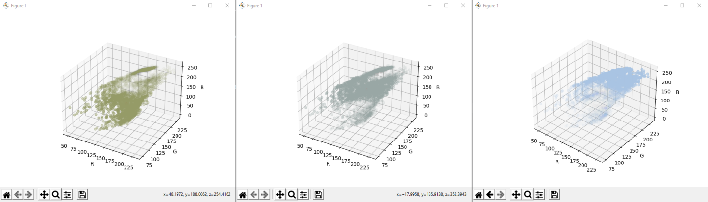

# C-means Color Image Segmentation

## Prerequisite
- [Python 3.9](https://www.python.org/downloads/release/python-390/)

Install The following Libraries :
- [Scipy](https://pypi.org/project/scipy/)
- [matplotlib](https://pypi.org/project/matplotlib/)
- [numpy](https://pypi.org/project/numpy/)
- [OpenCV](https://pypi.org/project/opencv-python/)

## What's Included ?
- 3 Variations of the Fuzzy C-means algorithm are included in this project and are in 3 different files in the ./variations folder:
  1. Basic Fuzzy C-Means Color Image Segmentation (file : ./variations/rfcm.py)
   
  2. Fuzzy C-Means with Ordering Split initialization  (file : ./variations/osfcm.py)
   
  3. Hybrid automatic Fuzzy C-means with histogram thresholding (file : ./variations/htfcm.py)
   
- The variations of C-means algorithm are inspired by the articles that can be found in the ./ressources folder.

- Test images are also included in the ./assets folder

## How to run ?
the three variations can be executed directly using a terminal.

The Files also accept arguments. The two required arguments are the image path and the number of clusters (not for htfcm)
```
dev@linux-desktop: python ./fcm.py 'image.jpg' 3
dev@linux-desktop: python ./osfcm.py 'image.jpg' 3
dev@linux-desktop: python ./htfcm.py 'image.jpg'
```
Each of the files support the ```-h``` argument to get help for the different available parameters :
```
dev@linux-desktop: python ./htfcm.py -h
usage: htfcm.py [-h] [-output_prefix [OUTPUT_PREFIX]] [-fuzzifier [FUZZIFIER]] [-termination_criteria [TERMINATION_CRITERIA]]
                [-scale_percent [SCALE_PERCENT]] [-peeks_minimum_height [PEEKS_MINIMUM_HEIGHT]]
                [-peeks_minimum_width [PEEKS_MINIMUM_WIDTH]] [-centers_minimum_distance_treshold [CENTERS_MINIMUM_DISTANCE_TRESHOLD]]
                [-save [SAVE]] [-plot [PLOT]]
                [image_dir]

HTFCM Params

positional arguments:
  image_dir             image path

optional arguments:
  -h, --help            show this help message and exit
  -output_prefix [OUTPUT_PREFIX]
                        result images prefix
  -output_dir [OUTPUT_DIR]
                        result images output folder eg: ./res
  -fuzzifier [FUZZIFIER]
                        Fuzzifier
  -termination_criteria [TERMINATION_CRITERIA]
                        Termination Criteria
  -scale_percent [SCALE_PERCENT]
                        Scale image to percentage of original image
  -peeks_minimum_height [PEEKS_MINIMUM_HEIGHT]
                        minimum histogram peek heights
  -peeks_minimum_width [PEEKS_MINIMUM_WIDTH]
                        minimum histogram peek widths
  -centers_minimum_distance_treshold [CENTERS_MINIMUM_DISTANCE_TRESHOLD]
                        minimum distance between centers
  -save [SAVE]          Store result images
  -plot [PLOT]          Plot result cluster points
```
### Default arguments
The default parameters for all the files are :
```python
# Prefix of the Resulting Files
output_prefix = ""
# Output Directory
output_dir = "."
# The Fizzifize
fuzzifier = 2
# The Termination Criteria
termination_criteria = 0.1
# Scale of the Final Image (We execute the algorithme on an image that has a size equal to 10% of the original image size)
scale_percent = 10
# Minimun Histogram Peek Height
peeks_minimum_height = 20
# Minimum histogram Peek Width
peeks_minimum_width = 5
# Minimum Distance Between the Peeks
centers_minimum_distance_treshold = 30
# Store the Results in Images ?
save = False
# Plot The Result Data ?
plot = False
```
## Results
### In Terminal
During execution we get the following information:
- Algorithm Parameters
- The final cluster centers
- The distance between the initial centrers and final ones
- The total number of iterations
- The execution time

Example:
```
dev@linux-desktop: python ./fcm.py 'image.jpg' 3
********
# of Clusters: 3
fuzzifier: 2
Termination Criteria: 0.1
Image Scaling Percentage: 10%
Original image Dimensions: 960x640
Resized image Dimensions: 96x64
********
Initialization...
Center Vector Initialization...
Membership matrix initialization...
Minimization
Updating Center Vectors...
Updating Membership matrix...
||Uk+1 - Uk|| : 1.27
Updating Center Vectors...
Updating Membership matrix...
||Uk+1 - Uk|| : 0.98
Updating Center Vectors...
Updating Membership matrix...
||Uk+1 - Uk|| : 0.90
Updating Center Vectors...
Updating Membership matrix...
||Uk+1 - Uk|| : 0.00
Centroids : [[ 83 110 104]
 [117 147 142]
 [193 178 141]]
Distance to final : 139.97872058683595
Iterations : 4
--- 8.6509342193604 seconds ---
dev@linux-desktop:
```
### Images
We ca also choose to store the results in RGBA images, we get as many images as clusters.

The color of the pixels of each image correspond to the color of the center of the cluster associated with the image. 

the alpha value of each pixel corresponds to the membership value of the pixel color to the center color.

We show the following example with 3 clusters :


### Plot
We Also have the choice to visualize the results by ploting the image points into an RGB Space.

The color of the points corresponds to the color of the center and the opacity of the point colors correspond to the membership value

The cluster center point is also shown and has a red color (hard to see sometimes when there's a lot of points)

Here is an example of what we get for 3 cluster :


